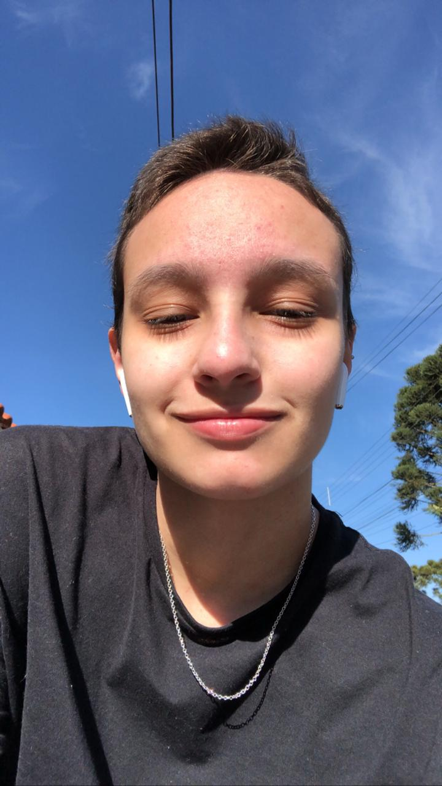

# Emanuelly Valenga Dias

# Welcome!

## I'm Emanuelly, it's a pleasure to have you here, so let me present a little about myself!

📕 Student of Node.JS, TypeScript, React and React Native;

💬 Intermediary English;

📚 Intermediate knowledge: HTML5, CSS3 and JavaScript;

👩‍💻 Freelancer of WebSites;

## About me 

